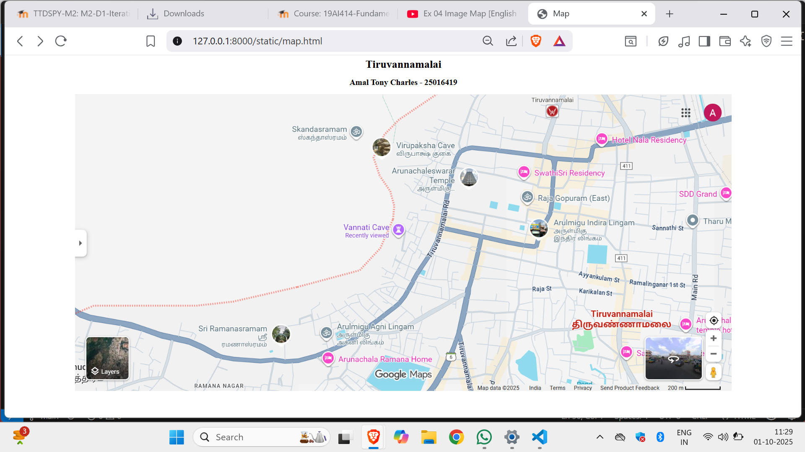
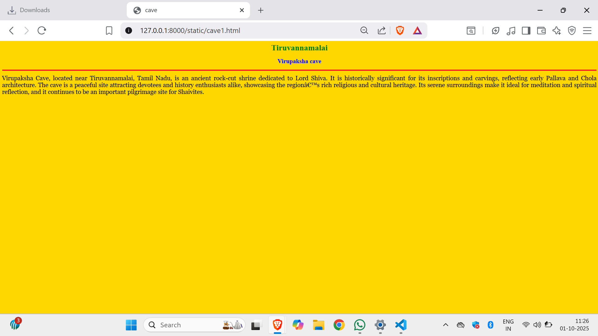
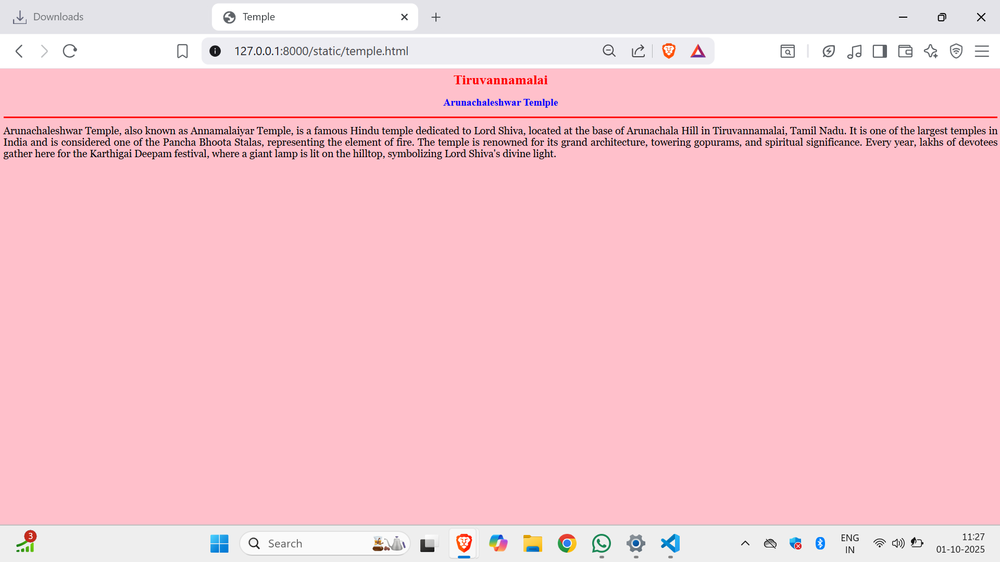
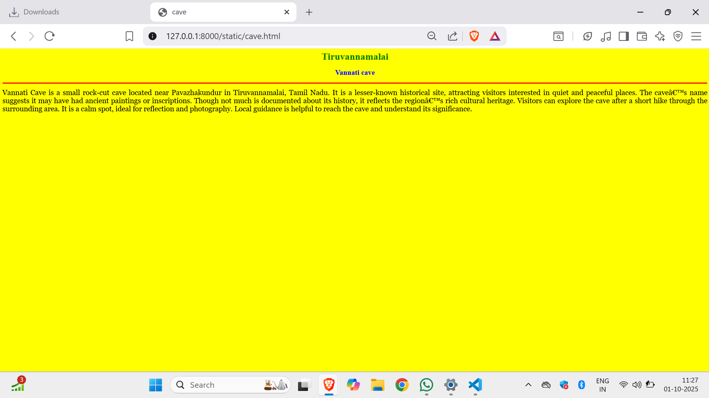
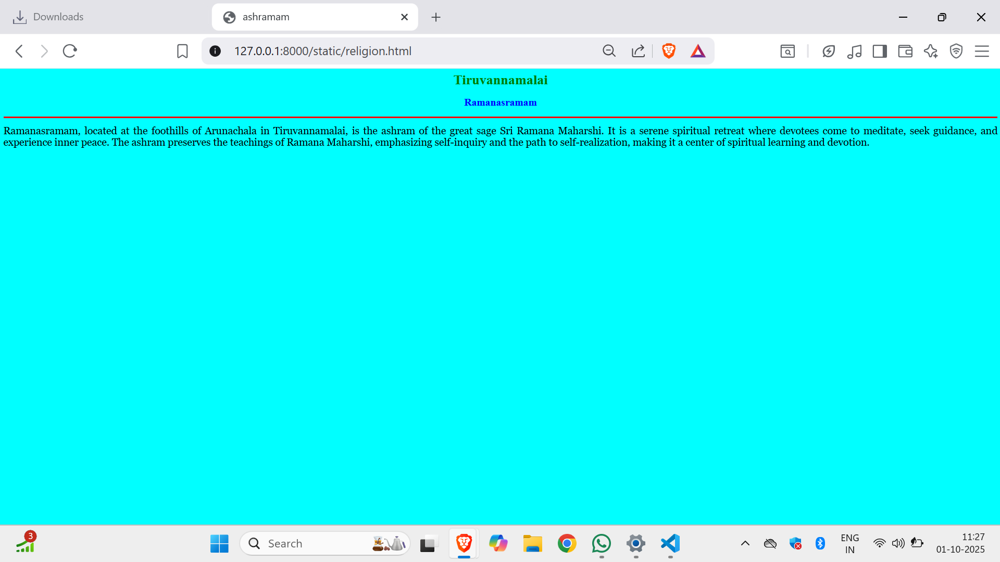
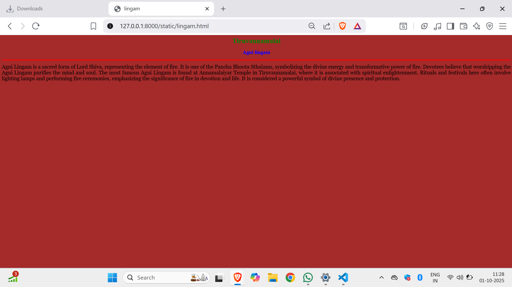

# Ex04 Places Around Me
## Date: 01.10.2025

## AIM
To develop a website to display details about the places around my house.

## DESIGN STEPS

### STEP 1
Create a Django admin interface.

### STEP 2
Download your city map from Google.

### STEP 3
Using ```<map>``` tag name the map.

### STEP 4
Create clickable regions in the image using ```<area>``` tag.

### STEP 5
Write HTML programs for all the regions identified.

### STEP 6
Execute the programs and publish them.

## CODE
```
map.html

<html>

<head>
    <title>Map</title>
</head>

<body>
    <center>
    <h1>Tiruvannamalai</h1>
    <h2>
        Amal Tony Charles - 25016419
    <center>
    </h2>
    


    <map name="image-map">
<!-- Image Map Generated by http://www.image-map.net/ -->


<map name="image-map">
    <area target="" alt="Annamalaiyar Temple" title="Annamalaiyar Temple" href="temple.html" coords="855,207,1231,314" shape="rect">
    <area target="" alt="Ramanasramam" title="Ramanasramam" href="religion.html" coords="300,620,658,780" shape="rect">
    <area target="" alt="Vannati cave " title="Vannati cave " href="cave.html" coords="748,336,1042,455" shape="rect">
    <area target="" alt="Virupaksha cave" title="Virupaksha cave" href="cave1.html" coords="773,72,1153,191" shape="rect">
    <area target="" alt="Agni lingam" title="Agni lingam" href="lingam.html" coords="705,640,1058,755" shape="rect">
</map>
</body>

</html>

temple.html

<html>

<head>

<title>Temple</title>

</head>

<body bgcolor="pink">

<h1 align="center">

<font color="red"><b>Tiruvannamalai</b></font>

</h1> 

<h2 align="center">

<font color="blue"><b>Arunachaleshwar Temlple</b></font>

</h2>

<hr size="3" color="red">

<p align="justify">

<font face="Georgia" size="5">

Arunachaleshwar Temple, also known as Annamalaiyar Temple, is a famous Hindu temple dedicated to Lord Shiva, located at the base of Arunachala Hill in Tiruvannamalai, Tamil Nadu. It is one of the largest temples in India and is considered one of the Pancha Bhoota Stalas, representing the element of fire. The temple is renowned for its grand architecture, towering gopurams, and spiritual significance. Every year, lakhs of devotees gather here for the Karthigai Deepam festival, where a giant lamp is lit on the hilltop, symbolizing Lord Shiva's divine light.
</p>

</body> </htm1>

cave.html
<html>

<head>

<title>cave</title>

</head>

<body bgcolor="yellow">

<h1 align="center">

<font color="green"><b>Tiruvannamalai</b></font>

</h1> 

<h2 align="center">

<font color="blue"><b>Vannati cave</b></font>

</h2>

<hr size="3" color="red">

<p align="justify">

<font face="Georgia" size="5">

Vannati Cave is a small rock-cut cave located near Pavazhakundur in Tiruvannamalai, Tamil Nadu. It is a lesser-known historical site, attracting visitors interested in quiet and peaceful places. The cave’s name suggests it may have had ancient paintings or inscriptions. Though not much is documented about its history, it reflects the region’s rich cultural heritage. Visitors can explore the cave after a short hike through the surrounding area. It is a calm spot, ideal for reflection and photography. Local guidance is helpful to reach the cave and understand its significance.
</p>

</body> </htm1>

cave1.html

<html>

<head>

<title>cave</title>

</head>

<body bgcolor="gold">

<h1 align="center">

<font color="green"><b>Tiruvannamalai</b></font>

</h1> 

<h2 align="center">

<font color="blue"><b>Virupaksha cave</b></font>

</h2>

<hr size="3" color="red">

<p align="justify">

<font face="Georgia" size="5">

Virupaksha Cave, located near Tiruvannamalai, Tamil Nadu, is an ancient rock-cut shrine dedicated to Lord Shiva. It is historically significant for its inscriptions and carvings, reflecting early Pallava and Chola architecture. The cave is a peaceful site attracting devotees and history enthusiasts alike, showcasing the region’s rich religious and cultural heritage. Its serene surroundings make it ideal for meditation and spiritual reflection, and it continues to be an important pilgrimage site for Shaivites.
</p>

</body> </htm1>

lingam.html

<html>

<head>

<title>lingam</title>

</head>

<body bgcolor="brown">

<h1 align="center">

<font color="green"><b>Tiruvannamalai</b></font>

</h1> 

<h2 align="center">

<font color="blue"><b>Agni lingam</b></font>

</h2>

<hr size="3" color="red">

<p align="justify">

<font face="Georgia" size="5">

Agni Lingam is a sacred form of Lord Shiva, representing the element of fire. It is one of the Pancha Bhoota Sthalams, symbolizing the divine energy and transformative power of fire. Devotees believe that worshipping the Agni Lingam purifies the mind and soul. The most famous Agni Lingam is found at Annamalaiyar Temple in Tiruvannamalai, where it is associated with spiritual enlightenment. Rituals and festivals here often involve lighting lamps and performing fire ceremonies, emphasizing the significance of fire in devotion and life. It is considered a powerful symbol of divine presence and protection.
</p>

</body> </htm1>

religion.html

<html>

<head>

<title>ashramam</title>

</head>

<body bgcolor="cyan">

<h1 align="center">

<font color="green"><b>Tiruvannamalai</b></font>

</h1> 

<h2 align="center">

<font color="blue"><b>Ramanasramam</b></font>

</h2>

<hr size="3" color="red">

<p align="justify">

<font face="Georgia" size="5">

Ramanasramam, located at the foothills of Arunachala in Tiruvannamalai, is the ashram of the great sage Sri Ramana Maharshi. It is a serene spiritual retreat where devotees come to meditate, seek guidance, and experience inner peace. The ashram preserves the teachings of Ramana Maharshi, emphasizing self-inquiry and the path to self-realization, making it a center of spiritual learning and devotion.
</p>

</body> </htm1>
```


## OUTPUT







## RESULT
The program for implementing image maps using HTML is executed successfully.
